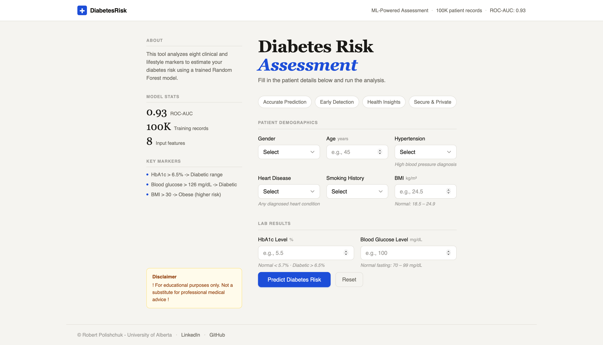

# Diabetes Prediction Model

A machine learning web application that predicts diabetes risk from eight clinical and lifestyle markers. Built end-to-end pipeline: from raw CSV data to a trained Random Forest model served through a Flask API with a clean, responsive frontend deployed on Render.

🔗 **Live Demo:** [diabetes-prediction-model-9xar.onrender.com](https://diabetes-prediction-model-9xar.onrender.com)

‼️ **Demo has to be deployed manually** ‼️

---

## Business Problem

Diabetes affects hundreds of millions of people worldwide, yet many cases go undetected until complications arise. Early-stage risk assessment,  based on routinely collected clinical data, can flag high-risk individuals before a formal diagnosis is made.

This project answers two core questions:

- Which clinical and lifestyle factors are most predictive of diabetes?
- Can we build a reliable, accessible tool that assigns a calibrated risk probability to a patient profile?

---

## Dataset

The project uses the [Diabetes Prediction Dataset](https://www.kaggle.com/datasets/iammustafatz/diabetes-prediction-dataset?resource=download) from Kaggle - a collection of 100,000 patient records combining medical and demographic information.

| Field | Description |
|-------|-------------|
| `gender` | Patient gender (Female / Male / Other) |
| `age` | Patient age in years |
| `hypertension` | High blood pressure diagnosis (0 / 1) |
| `heart_disease` | Any diagnosed heart condition (0 / 1) |
| `smoking_history` | Never / Former / Current / Ever / Not current / No info |
| `bmi` | Body Mass Index (kg/m²) |
| `HbA1c_level` | Glycated haemoglobin - 3-month average blood sugar (%) |
| `blood_glucose_level` | Fasting blood glucose (mg/dL) |
| `diabetes` | Target variable - 1 (Diabetic) / 0 (Not Diabetic) |

The dataset has a roughly 9:1 class imbalance (non-diabetic vs. diabetic), which is handled at the model level using `class_weight='balanced'`.

---

## Project Structure

```
Diabetes-Prediction-Model/
│ 
├── templates/
│   └── index.html
├── static/
│   ├── style.css
│   └── script.js
├── .gitignore
├── README.md
├── app.py
├── diabetes_prediction_dataset.csv
├── render.yaml
└── requirements.txt

```

---

## How It Works

### 1. Data Loading & Preprocessing - `app.py`

The dataset is loaded directly from CSV using pandas. On startup, the pipeline:

- Drops rows with missing values
- Encodes categorical features (`gender`, `smoking_history`) using fixed integer mappings
- Splits into train / test sets with `stratify=y` to preserve the class ratio
- Scales all features with `StandardScaler` before fitting

### 2. Model Training - `app.py`

A **Random Forest Classifier** is trained on startup and held in memory for inference.

**Why Random Forest?**
- Handles mixed feature types (numeric + ordinal encoded categoricals) robustly
- Less sensitive to outliers than linear models
- `class_weight='balanced'` directly compensates for the 9:1 class imbalance

**Key hyperparameters:**

| Parameter | Value | Reason |
|-----------|-------|--------|
| `n_estimators` | 200 | Stable ensemble with low variance |
| `max_depth` | 8 | Controls overfitting |
| `min_samples_split` | 20 | Prevents splits on noise |
| `min_samples_leaf` | 10 | Regularises leaf nodes |
| `class_weight` | `balanced` | Corrects 9:1 imbalance |

**Evaluation results:**

```
Test accuracy:  90.8%
```

| Case | Prediction | Non-Diabetic | Diabetic |
|------|-----------|-------------|---------|
| Healthy 22F, HbA1c 4.8, glucose 85 | Not Diabetic | 99.3% | 0.7% |
| 40M, borderline markers | Not Diabetic | 92.1% | 7.9% |
| 52M, hypertension, HbA1c 6.2 | Borderline | 61.4% | 38.6% |
| 60F, HbA1c 6.8, glucose 190 | Diabetic | 18.2% | 81.8% |
| 68M, HbA1c 9.5, glucose 280 | Diabetic | 0.5% | 99.5% |

### 3. Flask API - `app.py`

Two routes handle the application:

| Route | Method | Purpose |
|-------|--------|---------|
| `/` | GET | Serves the frontend |
| `/predict` | POST | Accepts JSON input, returns prediction + probabilities |

Input is validated server-side before inference (age, BMI, HbA1c, and blood glucose all have enforced ranges).

### 4. Frontend - `index.html`, `style.css`, `script.js`

A single-page interface built with vanilla HTML, CSS, and JavaScript. No frameworks.

- Two-column layout: sidebar with model stats and key clinical thresholds; main area with the input form
- Real-time field validation with visual feedback on invalid inputs
- Animated probability bars revealed on prediction
- Fully responsive - collapses to a single-column layout on mobile

---

## UI & Design

- Clean, modern two-column layout (info sidebar + input panel)  
- Simple and intuitive form with grouped inputs (demographics, health, labs)  
- Helpful placeholders and clear labels for ease of use  
- Blue accents highlight key actions (e.g., **Predict Diabetes Risk**)  
- Model stats and disclaimer improve transparency  



---

## Key Insights

- **HbA1c and blood glucose are the dominant predictors.** Values above 6.5% and 126 mg/dL respectively align with the clinical diagnostic thresholds for diabetes - the model learns and reflects this boundary sharply.
- **Age and BMI contribute meaningfully, but are not deterministic.** Older patients and those with higher BMI see elevated risk, but the model correctly assigns low probabilities to healthy profiles regardless of age.
- **The `class_weight='balanced'` flag is critical.** Without it, a naive model achieves ~90% accuracy by predicting "Not Diabetic" almost always - the balanced weights force the model to learn the diabetic minority class properly.
- **Confidence is well-calibrated.** Borderline profiles (HbA1c ~6.2, moderate glucose) receive genuinely uncertain outputs (~40% diabetic), while extreme profiles receive near-certain predictions in both directions.

---

## Technologies Used

| Tool | Purpose |
|------|---------|
| Python 3.9+ | Core language |
| pandas | Data loading and preprocessing |
| NumPy | Numerical operations |
| scikit-learn | Model training, scaling, and evaluation |
| Flask | REST API and server-side rendering |
| Gunicorn | Production WSGI server |
| HTML / CSS / JS | Frontend interface |
| Render | Cloud deployment |

---

## How to Run Locally

**1. Clone the repository and navigate to the project folder:**
```bash
git clone <repo-url>
cd Diabetes-Prediction-Model
```

**2. Install dependencies:**
```bash
pip install -r requirements.txt
```

**3. Place the dataset:**

Download `diabetes_prediction_dataset.csv` from [Kaggle](https://www.kaggle.com/datasets/iammustafatz/diabetes-prediction-dataset?resource=download) and place it in the project root.

**4. Run the app:**
```bash
python app.py
```

Visit `http://127.0.0.1:5000` in your browser. The model trains automatically on startup - this takes a few seconds.

---

## Limitations

- **No SHAP explainability.** The model outputs a probability but does not break down which features drove the prediction for a specific patient.
- **Static training data.** The model is trained once on a fixed dataset and does not update with new inputs submitted through the UI.
- **Ordinal encoding for categoricals.** Smoking history is mapped to integers (0–5), which imposes an implicit ordering that may not reflect reality.
- **No cross-validation reported.** Model performance is based on a single 80/20 train-test split rather than k-fold CV.

---

## Future Improvements

- **SHAP explainability** - Add per-prediction feature importance so users can see which markers drove the result, strengthening clinical interpretability.
- **Expanded metrics** - Report precision, recall, F1, and ROC-AUC alongside accuracy to better reflect performance on the imbalanced class.
- **Model comparison** - Benchmark Random Forest against XGBoost and Logistic Regression to justify the architecture choice empirically.
- **Retraining endpoint** - Allow the model to be retrained on an updated dataset without redeploying the application.
- **Additional risk factors** - Incorporate family history, physical activity level, or dietary features if a richer dataset becomes available.
